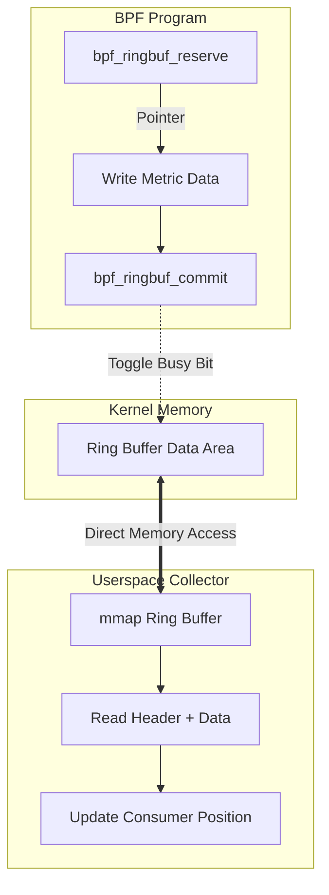

# Deep Dive: High-Performance Metrics Collection with eBPF Ring Buffers

In modern observability, collecting high-frequency metrics (e.g., per-packet networking stats or scheduler latencies) requires a data path that minimizes CPU overhead and memory copying. For years, the **BPF Perf Buffer** was the standard. However, as of Linux 5.8, the **BPF Ring Buffer** has emerged as a superior alternative for Multi-Producer Single-Consumer (MPSC) workloads.

This article explores the internal memory layout of eBPF ring buffers, compares them to the legacy perf buffer, and demonstrates how to implement zero-copy data extraction in Rust.

## The Architectural Flaw of Perf Buffers

The legacy `BPF_MAP_TYPE_PERF_EVENT_ARRAY` allocates a **per-CPU** buffer. While this avoids cross-CPU locking, it introduces two major issues:
1.  **Memory Inefficiency**: You must size buffers for the "burstiest" CPU. If one CPU handles 90% of interrupts, its buffer fills while others sit idle.
2.  **Event Ordering**: Events from different CPUs are delivered to userspace out-of-order, necessitating complex re-ordering logic in the collector.

## BPF Ring Buffer: The MPSC Solution

The `BPF_MAP_TYPE_RINGBUF` is a global, shared memory area. It uses a sophisticated header-based protocol to allow concurrent writers (producers) while maintaining a strict linear order for the reader (consumer).

### 1. The Bit-Level Header Structure

Every record in the ring buffer is preceded by an 8-byte (64-bit) header. This header is the synchronization point between the kernel and userspace.

| Bits | Field | Description |
| :--- | :--- | :--- |
| 0-29 | **Length** | The actual size of the data payload (max 1GB). |
| 30 | **Busy Bit** | Set to `1` during `bpf_ringbuf_reserve`. Consumer skips this. |
| 31 | **Discard Bit** | Set to `1` if `bpf_ringbuf_discard` is called. |
| 32-63 | **Offset** | Relative offset for internal kernel memory management. |

**The Zero-Copy Magic:**
Unlike the perf buffer, which requires `bpf_perf_event_output` (involving a `memcpy` from BPF stack to buffer), the Ring Buffer allows **Reservation**. `bpf_ringbuf_reserve` returns a pointer directly into the ring buffer memory. You write your metric data directly to this memory and then `commit`.



## Implementation: Zero-Copy Extraction in Rust

Using the `aya` or `libbpf-rs` ecosystem, we can consume these metrics efficiently. The key is to map the buffer into userspace and interpret the headers without copying the underlying data.

### Bit-Level Header Masking (Rust)

When manually parsing the ring buffer (though libraries usually handle this), the bitwise logic for checking record status is critical:

```rust
const BPF_RINGBUF_BUSY_BIT: u32 = 1 << 31;
const BPF_RINGBUF_DISCARD_BIT: u32 = 1 << 30;
const BPF_RINGBUF_HDR_SZ: usize = 8;

/// Represents the header of a RingBuf record
#[repr(C)]
struct RingBufHeader {
    len_and_flags: u32,
    pg_off: u32,
}

impl RingBufHeader {
    fn length(&self) -> usize {
        // Mask out the top 2 bits (Busy and Discard)
        (self.len_and_flags & 0x3FFFFFFF) as usize
    }

    fn is_busy(&self) -> bool {
        (self.len_and_flags & BPF_RINGBUF_BUSY_BIT) != 0
    }

    fn is_discarded(&self) -> bool {
        (self.len_and_flags & BPF_RINGBUF_DISCARD_BIT) != 0
    }
}
```

### The "Double-Mmap" Paradox

A fascinating kernel implementation detail: the BPF ring buffer is **mapped twice contiguously** in virtual memory.
- Page 0 to N: Data Area
- Page N+1 to 2N: Exact same Data Area

**Why?** This allows the kernel to avoid "wrap-around" logic. If a record starts at the very end of the buffer and spills over, it simply continues into the next virtual page, which maps back to the start of the physical buffer. This makes the pointer returned by `bpf_ringbuf_reserve` always contiguous.

## Performance Trade-offs: Ring Buffer vs. Perf Buffer

| Metric | Perf Buffer | Ring Buffer |
| :--- | :--- | :--- |
| **Ordering** | Per-CPU (Mixed) | Global (Strict) |
| **Memory** | Static per-CPU | Shared (Dynamic) |
| **Mechanism** | `bpf_perf_event_output` (Copy) | `bpf_ringbuf_reserve` (Zero-Copy) |
| **Overhead** | Lower contention | Spinlock on reservation |

**Research Question:** Since `bpf_ringbuf_reserve` uses a spinlock internally to increment the producer counter, at what CPU count does the contention on a single global Ring Buffer outweigh the overhead of re-ordering per-CPU Perf Buffers in userspace?

**The Paradox:** In high-core count systems (e.g., 128+ cores), a single global ring buffer can become a bottleneck due to cache-line bouncing of the spinlock. However, a "Sharded Ring Buffer" (one per NUMA node) often provides the optimal balance between ordering and throughput, yet this pattern is rarely implemented in standard monitoring agents.

---
**Technical References:**
- [Linux Kernel: BPF Ring Buffer Documentation](https://docs.kernel.org/bpf/ringbuf.html)
- [BGP: BPF Ring Buffer - Libbpf Implementation Details](https://nakryiko.com/posts/bpf-ringbuf/)
- [Aya: Write eBPF programs in Rust](https://aya-rs.dev/)
- [Kernel Source: kernel/bpf/ringbuf.c](https://github.com/torvalds/linux/blob/master/kernel/bpf/ringbuf.c)
