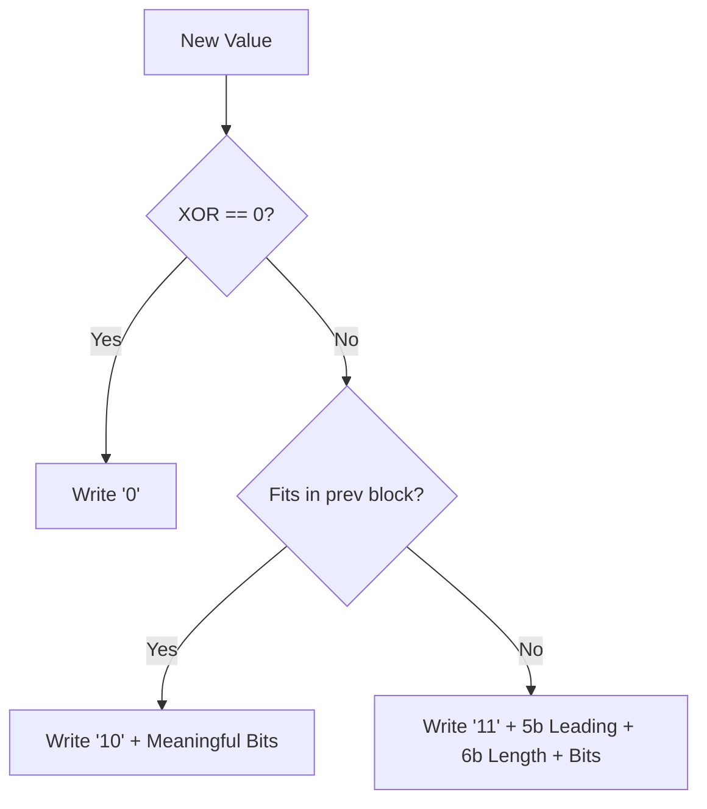

# Bit-Level Anatomy of TSDB Compression: Gorilla vs Custom SIMD

Time-Series Databases (TSDBs) live and die by their compression ratios. The industry standard, inspired by Facebook's Gorilla paper, uses delta-of-deltas for timestamps and XOR encoding for floating-point values. But what does the bitstream actually look like, and how do modern implementations in Rust and Go diverge?

## The Bitstream Breakdown

When compressing a series of 64-bit floats, the XOR difference between consecutive values is calculated. The bits are then packed densely.

### XOR Encoding State Table

Consider values $V_1 = 12.0$ and $V_2 = 12.5$.
1. $V_1$: `0x4028000000000000`
2. $V_2$: `0x4029000000000000`
3. $XOR$: `0x0001000000000000`

| State | Bit Marker | Data Bits | Explanation |
|-------|------------|-----------|-------------|
| Same value | `0` | None | $V_n = V_{n-1}$, 1 bit total |
| Inside previous block | `10` | Meaningful bits | XOR block falls within the previous leading/trailing zeros |
| New block | `11` | 5 (leading) + 6 (length) + Data | New boundaries for significant bits |



## Hardcore Code: SIMD-Optimized Gorilla in Rust

While the standard algorithm writes variable-length bits sequentially, modern CPUs hate bit-by-bit operations. We can use SIMD to process 4 or 8 floats simultaneously, but the variable-length nature of Gorilla makes this tricky. We use `std::arch::x86_64` to calculate the XORs in parallel before doing scalar bit-packing.

```rust
use std::arch::x86_64::*;

#[inline(always)]
pub unsafe fn xor_4_floats(prev: *const f64, curr: *const f64) -> __m256i {
    let p = _mm256_loadu_pd(prev);
    let c = _mm256_loadu_pd(curr);
    
    // Cast to integers for bitwise XOR
    let p_int = _mm256_castpd_si256(p);
    let c_int = _mm256_castpd_si256(c);
    
    _mm256_xor_si256(p_int, c_int)
}

// Extracting leading zeros from SIMD register requires moving to GPRs
pub unsafe fn get_leading_zeros(xor_vec: __m256i) -> [u32; 4] {
    let mut out: [u64; 4] = [0; 4];
    _mm256_storeu_si256(out.as_mut_ptr() as *mut __m256i, xor_vec);
    
    [
        out[0].leading_zeros(),
        out[1].leading_zeros(),
        out[2].leading_zeros(),
        out[3].leading_zeros()
    ]
}
```
*Note: We skip the `BitWriter` boilerplate here. The crunch is in the parallel XOR and tzcnt/lzcnt.*

## Architectural Trade-offs: Rust vs. Go

1. **Rust (Custom SIMD)**: Exposes raw intrinsics (`_mm256_xor_si256`). Perfect for batching float ingestion (e.g., from an Apache Arrow buffer). However, the bit-packing phase inevitably falls back to scalar loops, limiting the theoretical SIMD speedup.
2. **Go (Standard Implementation)**: Prometheus uses a standard Gorilla implementation in Go. Go's lack of macro-level SIMD intrinsics (outside of Assembly) means it relies purely on scalar operations.

## The Performance Paradox

**Research Question:** Why does a pure scalar Go implementation of Gorilla often outperform a naive SIMD-optimized Rust one in streaming ingestion benchmarks?

The answer lies in **branch prediction and cache locality, not raw compute**. Time-series data often changes predictably (e.g., CPU temp). The CPU branch predictor correctly guesses the `10` (inside previous block) path 95% of the time in scalar Go. The Rust SIMD approach, by processing in chunks of 4, often breaks pipelining during the scalar bit-packing phase when the chunk has mixed bit-lengths, causing branch mispredictions that wipe out the vectorized XOR gains.

*Always measure the holistic pipeline, not just the math instructions.*