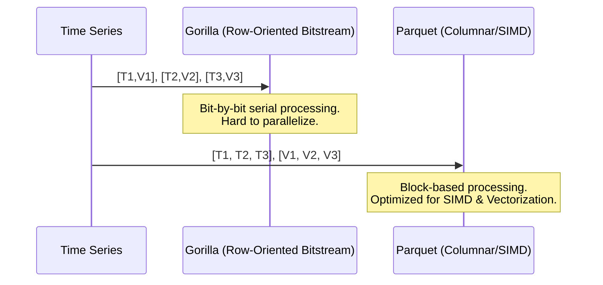

# The Evolution of TSDB Compression: From Gorilla to InfluxDB 3

In the world of high-scale observability, data volume is the enemy of performance. A system collecting 10 million metrics per second generates nearly a trillion data points a day. Without aggressive compression, storage costs and query latency would make such systems economically and technically unfeasible.

Over the last decade, TSDB (Time Series Database) compression has evolved from custom-tailored bit-stream algorithms to standardized columnar formats. This article explores that journey, focusing on the techniques that defined an era.

## The Gorilla Era: Exploiting Regularity

In 2015, Facebook published the seminal paper [**"Gorilla: A Fast, Scalable, In-Memory Time Series Database"**](https://www.vldb.org/pvldb/vol8/p1816-teller.pdf). It introduced two key techniques that became the industry standard for nearly a decade: Delta-of-Delta for timestamps and XOR compression for values.

### 1. Timestamps: Delta-of-Delta Encoding

Most time-series data is periodic (e.g., every 60 seconds). In a perfect world, the difference between consecutive timestamps (the "delta") is constant. [Delta-of-Delta encoding](https://en.wikipedia.org/wiki/Delta_encoding) exploits this.

#### Step-by-Step Walk-through
Let's compress the sequence: `[1643673600, 1643673660, 1643673722, 1643673780]`

1.  **Calculate Deltas**:
    *   $t_1 - t_0 = 1643673660 - 1643673600 = 60$
    *   $t_2 - t_1 = 1643673722 - 1643673660 = 62$
    *   $t_3 - t_2 = 1643673780 - 1643673722 = 58$

2.  **Calculate Delta-of-Deltas ($D$):**
    *   $D_1 = (t_2 - t_1) - (t_1 - t_0) = 62 - 60 = 2$
    *   $D_2 = (t_3 - t_2) - (t_2 - t_1) = 58 - 62 = -4$

3.  **Bit-Stream Representation (Simplified Gorilla):**
    *   **$D=0$**: Store bit `0`. (1 bit)
    *   **$-63 \le D \le 64$**: Store bits `10` followed by 7 bits of $D$. (9 bits)
    *   **$-255 \le D \le 256$**: Store bits `110` followed by 9 bits of $D$. (12 bits)
    *   ...and so on for larger ranges.

For our sequence:
*   $D_1 = 2$: Prefix `10`, value `0000010` (9 bits total)
*   $D_2 = -4$: Prefix `10`, value `1111100` (two's complement, 9 bits total)

Compared to storing a 64-bit integer, we used only 9 bits.

### 2. Values: XOR Compression

Floating-point values ([IEEE 754](https://en.wikipedia.org/wiki/IEEE_754)) often change slowly. When you XOR two consecutive values ($v_n \oplus v_{n-1}$), identical bits result in `0`.

```mermaid
graph LR
    V1[Value N-1] -- XOR -- Result[XOR Result]
    V2[Value N] -- XOR -- Result
    Result --> Zeros[Leading/Trailing Zeros]
    Zeros --> Meaningful[Meaningful Bits]
```

## Implementation: Core Gorilla in Rust

Below is a simplified implementation of the Gorilla-style bit-packing logic in Rust, focusing on the XOR compression of 64-bit floats.

```rust
/// A simplified XOR compressor for f64 values.
pub struct GorillaValueCompressor {
    last_value: u64,
    last_leading_zeros: u32,
    last_trailing_zeros: u32,
    first: bool,
}

impl GorillaValueCompressor {
    pub fn new() -> Self {
        Self {
            last_value: 0,
            last_leading_zeros: u32::MAX,
            last_trailing_zeros: 0,
            first: true,
        }
    }

    pub fn compress(&mut self, val: f64) -> Vec<u8> {
        let x = val.to_bits();
        if self.first {
            self.last_value = x;
            self.first = false;
            // In a real impl, we'd write the full 64 bits here.
            return x.to_be_bytes().to_vec();
        }

        let xor = x ^ self.last_value;
        self.last_value = x;

        if xor == 0 {
            return vec![0b0]; // Single '0' bit
        }

        let leading = xor.leading_zeros();
        let trailing = xor.trailing_zeros();
        
        // This is where bit-packing (writing specific bit lengths) occurs.
        // For brevity, we return a symbolic representation.
        self.encode_xor(xor, leading, trailing)
    }

    fn encode_xor(&mut self, xor: u64, leading: u32, trailing: u32) -> Vec<u8> {
        // Logic for '1' prefix + leading/trailing zero checks...
        // ... (truncated for conceptual clarity)
        vec![0b1] 
    }
}
```

## The Paradigm Shift: InfluxDB 3 and Parquet

InfluxDB 3 moved away from custom bit-streams toward [Apache Parquet](https://parquet.apache.org/docs/), a columnar storage standard.

### Gorilla vs. Parquet (Columnar)



### Modern Techniques: SIMD and Bit-packing

Modern engines use [SIMD](https://en.wikipedia.org/wiki/Single_instruction,_multiple_data) (Single Instruction, Multiple Data) to process blocks of values at once. Instead of Gorilla's bit-at-a-time branching, Parquet's `DELTA_BINARY_PACKED` uses [Bit-packing](https://en.wikipedia.org/wiki/Bit_packing) and [Varint](https://en.wikipedia.org/wiki/Variable-length_quantity) encoding.

1.  **Block Deltas**: Calculate deltas for a block (e.g., 128 values).
2.  **Min Delta**: Find the minimum delta.
3.  **Subtract**: Subtract min delta from all.
4.  **Bit-width**: Find the max bits needed and pack the entire block.

## Summary

The evolution from Gorilla to InfluxDB 3 is a story of maturing infrastructure. We have moved from specialized, "hand-crafted" compression aimed at saving every possible bit in RAM, to standardized, block-oriented columnar formats optimized for disk I/O and ecosystem interoperability.

---
**Technical References:**
- [IEEE 754 Standard for Floating-Point Arithmetic](https://ieeexplore.ieee.org/document/8766229)
- [Gorilla: Facebook's In-Memory TSDB](https://www.vldb.org/pvldb/vol8/p1816-teller.pdf)
- [Apache Parquet Encoding Specifications](https://parquet.apache.org/docs/file-format/data-pages/encodings/)
- [Rust `std::simd` Documentation](https://doc.rust-lang.org/std/simd/index.html)
