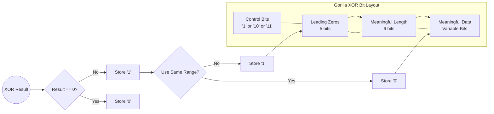

# The Evolution of TSDB Compression: From Gorilla to InfluxDB 3

In the world of high-scale observability, data volume is the enemy of performance. A system collecting 10 million metrics per second generates nearly a trillion data points a day. Without aggressive compression, storage costs and query latency would make such systems economically and technically unfeasible.

Over the last decade, TSDB (Time Series Database) compression has evolved from custom-tailored bit-stream algorithms to standardized columnar formats. This article explores that journey, focusing on the techniques that defined an era.

## The Gorilla Era: Exploiting Regularity

In 2015, Facebook published the seminal paper [**"Gorilla: A Fast, Scalable, In-Memory Time Series Database"**](https://www.vldb.org/pvldb/vol8/p1816-teller.pdf). It introduced two key techniques that became the industry standard for nearly a decade: Delta-of-Delta for timestamps and XOR compression for values.

### 1. Timestamps: Delta-of-Delta Encoding

Most time-series data is periodic (e.g., every 60 seconds). In a perfect world, the difference between consecutive timestamps (the "delta") is constant. Delta-of-Delta encoding exploits this regularity.

#### Step-by-Step Walk-through
Let's compress the sequence: `[1643673600, 1643673660, 1643673722, 1643673780]`

| Timestamp | Value ($t_n$) | Delta ($\Delta$) | Delta-of-Delta ($D$) | Bits Stored (Gorilla) |
| :--- | :--- | :--- | :--- | :--- |
| $t_0$ | 1643673600 | - | - | Full 64 bits |
| $t_1$ | 1643673660 | 60 | - | Full 14-bit Delta |
| $t_2$ | 1643673722 | 62 | $62 - 60 = 2$ | `10` + `0000010` (9 bits) |
| $t_3$ | 1643673780 | 58 | $58 - 62 = -4$ | `10` + `1111100` (9 bits) |

**Bitstream State:**
To decode $t_2$, the reader must have already decoded $t_0$, $t_1$, and the first delta ($60$). The bitstream is fundamentally **serial**: you cannot calculate $t_n$ without traversing all previous bits to maintain the running sum of deltas.

### 2. Values: XOR Compression

Floating-point values ([IEEE 754](https://en.wikipedia.org/wiki/IEEE_754)) often change slowly. When you XOR two consecutive values ($v_n \oplus v_{n-1}$), identical bits result in `0`.



**Diagram Explanation:**
The flowchart above illustrates the decision tree for every value in the XOR stream.
- **Control Bits**: The first 1 or 2 bits determine the "state". A `0` means the value is identical to the previous. A `10` means we reuse the previous "leading zeros" and "meaningful length" counts to save metadata space. A `11` signals a completely new range of meaningful bits.
- **Leading Zeros (5 bits)**: Stores the number of zeros at the start of the XOR result (up to 31).
- **Meaningful Length (6 bits)**: Stores how many bits of actual data follow.
- **Meaningful Data**: The actual XORed bits that changed.

By omitting trailing zeros and reusing metadata, Gorilla achieves high compression for floats that change incrementally.

## Runnable Demos

To see these algorithms in action, I have implemented minimal, runnable examples in the repository:

- **[Gorilla XOR Demo (Go)](https://github.com/winter-loo/devnotes/blob/main/demo/gorilla-xor-go/main.go)**: A step-by-step trace of how floating-point values are XORed and how leading/trailing zeros are calculated.
- **[Bit-packing Demo (Rust)](https://github.com/winter-loo/devnotes/blob/main/demo/simd-bitpacking-rust/src/main.rs)**: A clean implementation of packing multiple small integers into a single 64-bit word, the foundation of modern SIMD TSDBs.

## Implementation: The Core XOR Logic in Rust

To understand how Gorilla is implemented, we look at the encoder state. It must track the previous value and the previous leading/trailing zero counts to decide which control bits to write.

```rust
struct GorillaEncoder {
    writer: BitWriter,
    last_value: u64,
    last_leading: u32,
    last_trailing: u32,
    first: bool,
}

impl GorillaEncoder {
    /// High-level function to compress a single f64 value
    pub fn compress(&mut self, val: f64) {
        let x = val.to_bits(); // Get raw IEEE 754 bits
        if self.first {
            self.last_value = x;
            self.first = false;
            self.writer.write_bits(x, 64); // First value is stored in full
            return;
        }

        let xor = x ^ self.last_value;
        self.last_value = x;

        if xor == 0 {
            self.writer.write_bit(false); // Store '0' (Identical value)
        } else {
            let leading = xor.leading_zeros();
            let trailing = xor.trailing_zeros();
            // Call the core bit-manipulation logic
            self.encode_xor(xor, leading, trailing);
        }
    }

    /// Core logic for encoding the XORed bit-difference
    fn encode_xor(&mut self, xor: u64, leading: u32, trailing: u32) {
        self.writer.write_bit(true); // Store '1' (Value changed)
        
        if leading >= self.last_leading && trailing >= self.last_trailing {
            // Control '10': Reuse previous leading/trailing metadata
            self.writer.write_bit(false);
            let meaningful_bits = 64 - self.last_leading - self.last_trailing;
            self.writer.write_bits(xor >> self.last_trailing, meaningful_bits);
        } else {
            // Control '11': Write new leading/trailing counts
            self.writer.write_bit(true);
            self.writer.write_bits(leading as u64, 5); // 5 bits for leading
            
            let meaningful_bits = 64 - leading - trailing;
            self.writer.write_bits(meaningful_bits as u64, 6); // 6 bits for length
            self.writer.write_bits(xor >> trailing, meaningful_bits);
            
            self.last_leading = leading;
            self.last_trailing = trailing;
        }
    }
}
```

## The Paradigm Shift: Serial vs. SIMD

The primary limitation of Gorilla is its **"bit-at-a-time branching"**. Because every value's interpretation depends on the control bits of the previous value, the CPU's branch predictor is heavily taxed. Every `if xor == 0` or `if leading >= last_leading` creates a branch. In a serial bitstream, the CPU cannot easily look ahead to execute instructions for $v_{n+1}$ while still decoding $v_n$, severely limiting **Instruction-Level Parallelism (ILP)**.

In contrast, modern engines like InfluxDB 3 (via Apache Parquet) utilize **SIMD block processing**. By sacrificing the extreme "per-value" compression ratio of Gorilla for fixed-size blocks, they unlock massive hardware acceleration.

### Deep Dive: SIMD Block Processing in Rust

In a vectorized TSDB, instead of writing a continuous bitstream where each value depends on the previous, we process blocks of data (e.g., 64 or 128 values) at once. The core advantage is not just "packing faster," but **branchless metadata calculation**.

#### The "Max-bits" Win
In Gorilla, for every value, we must check: "Is the delta the same as before? Does it fit in the current range?" This is a branch. In a block-based system, we calculate the maximum number of bits needed for the entire block ($W$) and then pack all values using exactly $W$ bits.

Using Rust's `std::simd` (Portable SIMD), calculating this $W$ for 8 values becomes a branchless operation:

```rust
use std::simd::u32x8;

pub fn calculate_max_bits(deltas: &[u32; 8]) -> u32 {
    let v = u32x8::from_array(*deltas);
    // Vectorized OR: combines all deltas into one mask
    // If any delta has bit 7 set, the final 'reduced' value will have bit 7 set.
    let reduced = v.reduce_or(); 
    
    // Total bits needed is 32 minus the leading zeros of the OR-sum
    32 - reduced.leading_zeros()
}
```

**Why this is faster:**
1. **Branchless**: There are no `if` statements in the loop. The CPU pipelines the instructions perfectly.
2. **Deterministic**: Every block of 8 values takes the exact same number of cycles to process, regardless of the data values.
3. **Hardware Alignment**: Modern CPUs (AVX-512) can do this for 16 or 32 values in a single instruction.

| Aspect | Gorilla (Bitstream) | Parquet (SIMD/Bit-packing) |
| :--- | :--- | :--- |
| **Data Layout** | Hybrid (Values interleaved) | Pure Columnar |
| **Processing** | Serial (Bit-by-bit) | Vectorized (128+ values at once) |
| **Hardware** | Scalar CPU (Branch-heavy) | AVX-512 / NEON (Branchless) |
| **Throughput** | Limited by Branch Predictor | Limited by Memory Bandwidth |
| **Random Access** | Impossible (must scan) | Possible at block boundaries |

## The VictoriaMetrics Paradox: Why Go still beats Rust/SIMD?

Despite the theoretical superiority of SIMD and Rust's low-level control, [VictoriaMetrics](https://victoriametrics.com/) (written in Go) consistently outperforms many "modern" Rust TSDBs. This raises a provocative question: **Is the architectural overhead of Parquet worth it?**

1.  **The \"Go SIMD\" Reality**: Go lacks direct SIMD intrinsics in the language, yet VM achieves incredible throughput by using highly optimized assembly for critical loops and sticking to a \"shared-nothing\" architecture that minimizes GC pressure.
2.  **Parquet's Tax**: While Parquet is great for interoperability, the overhead of its complex metadata and the \"shredding\" required to turn rows into columns can outweigh the raw speed of SIMD if the query pattern is simple.
3.  **The Bitstream Defense**: VictoriaMetrics proves that if you optimize the *memory access patterns* and minimize allocations, a well-tuned bitstream implementation can often beat a generic columnar implementation due to better cache locality for specific time-series workloads.

The trade-off remains: Do you want the **ecosystem compatibility** of Parquet/Arrow, or the **raw, specialized efficiency** of a custom bitstream?

---
**Technical References:**
- [IEEE 754 Standard for Floating-Point Arithmetic](https://ieeexplore.ieee.org/document/8766229)
- [Gorilla: Facebook's In-Memory TSDB](https://www.vldb.org/pvldb/vol8/p1816-teller.pdf)
- [Bit-packing / RLE Hybrid Explained (Apache Parquet)](https://parquet.apache.org/docs/file-format/data-pages/encodings/#RLE) - *Comprehensive guide to modern bit-packing.*
- [Apache Parquet Encoding Specifications](https://parquet.apache.org/docs/file-format/data-pages/encodings/)
- [Rust `std::simd` Documentation](https://doc.rust-lang.org/std/simd/index.html)
