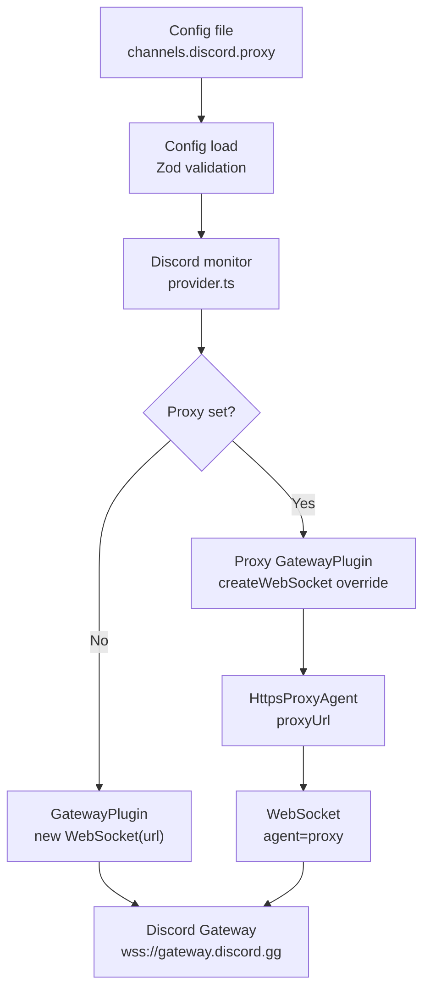

# Discord Gateway Proxy Support (OpenClaw)

# Discord Gateway Proxy Support — Implementation Overview

This document explains how the Discord gateway proxy support works in OpenClaw, starting from zero context.

## 1. What Problem We Solve

In some networks, outbound internet access is blocked unless traffic goes through a local proxy (for example,
`http://127.0.0.1:5780`). The Discord gateway uses a WebSocket connection to `wss://gateway.discord.gg/`, so if
direct outbound TCP is blocked, the connection fails with timeouts.

The goal is to let OpenClaw connect the Discord gateway through a user-specified HTTP(S) proxy.

## 2. Where the Configuration Lives

OpenClaw stores channel configuration under `channels.<channelName>` in the main config.

We added a new optional field:

- `channels.discord.proxy`: a string containing the proxy URL

This can also be set per Discord account:

- `channels.discord.accounts.<accountId>.proxy`

## 3. Config Type Definitions

The Discord config types live in `src/config/types.discord.ts`. We added:

- `proxy?: string;` in `DiscordAccountConfig`

This makes the proxy field a first-class config setting for Discord accounts.

## 4. Config Validation (Zod Schema)

All config is validated at load time through Zod schemas in `src/config/zod-schema.providers-core.ts`. We added:

- `proxy: z.string().optional()`

This allows the new field to pass validation when present.

## 5. Config Schema Labels / Descriptions

OpenClaw also maintains a schema registry in `src/config/schema.ts` used for CLI help and docs. We added:

- `channels.discord.proxy`: labeled as a Discord gateway proxy URL

This makes the field discoverable in CLI output and docs tooling.

## 6. How the Discord Gateway Connection Is Created

Discord connections are handled by the Carbon client and its `GatewayPlugin` in `src/discord/monitor/provider.ts`.
For background on Carbon’s gateway plugin, see the official docs: [https://carbon.buape.com/plugins](https://carbon.buape.com/plugins).

Originally, the client was created like this:

- A new `GatewayPlugin` instance was created directly.
- The plugin internally creates a WebSocket with `new WebSocket(url)`.
- There was no way to inject a proxy.

We changed this by inserting a custom GatewayPlugin that overrides its WebSocket creation.

## 7. Proxy-Aware GatewayPlugin

We added a helper function in `src/discord/monitor/provider.ts`:

- `createDiscordGatewayPlugin({ discordConfig, runtime })`

This does the following:

1. Reads `discordConfig.proxy`.
2. If no proxy is set, it returns a normal `GatewayPlugin` with the usual options.
3. If a proxy is set:
   - It constructs an `HttpsProxyAgent` with that proxy URL.
   - It defines a small subclass of `GatewayPlugin` that overrides `createWebSocket`.
   - The overridden method uses:
     - `new WebSocket(url, { agent: proxyAgent })`

This causes all gateway WebSocket traffic to be tunneled through the proxy.

## 8. Dependency Used

We added the dependency `https-proxy-agent` to the main `package.json`.

This library provides the `HttpsProxyAgent` class, which is compatible with the `ws` WebSocket client used by Carbon.

## 9. End-to-End Flow Summary

1. User sets `channels.discord.proxy` in config.
2. Config loads and validates successfully.
3. Discord monitor (`src/discord/monitor/provider.ts`) resolves the Discord account config.
4. It calls `createDiscordGatewayPlugin(...)`.
5. The gateway plugin is created with a proxy-aware WebSocket.
6. Discord gateway connects via the proxy instead of direct outbound TCP.

## 9.1 Visual Flow Diagram



## 10. Example Config

```
channels:
  discord:
    token: "<your token>"
    proxy: "http://127.0.0.1:5780"
```

Per-account override:

```
channels:
  discord:
    accounts:
      primary:
        token: "<your token>"
        proxy: "http://127.0.0.1:5780"
```

## Conclusion

The core idea is simple: **Discord’s gateway is a WebSocket, not a REST call**, so the proxy
must be applied at the WebSocket layer. We wrap Carbon’s `GatewayPlugin` with a small subclass
that overrides `createWebSocket` to attach an `HttpsProxyAgent`. This keeps the rest of the
Discord integration untouched, while ensuring gateway traffic is tunneled through your proxy
whenever `channels.discord.proxy` is set.
